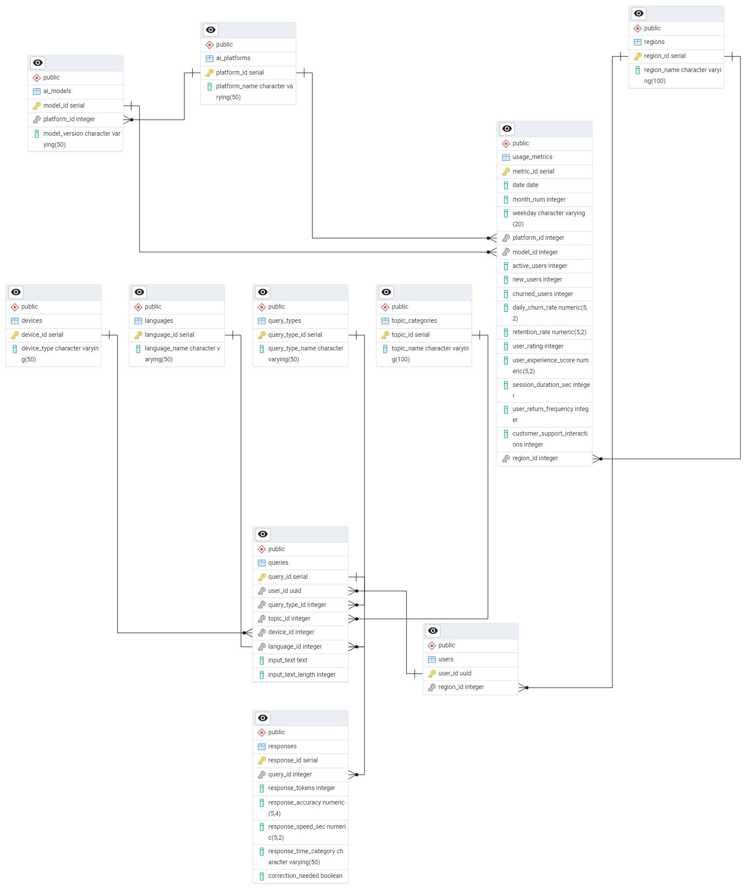

# AI Model War — DeepSeek vs. ChatGPT

> Academic Project · Data Models and Query Languages · University at Buffalo  
> **Team:** Anirudh Sanjay Mhaske · Suvidha Vidyasagar Deshpande · Vidit Rajesh Prabhu

---

## Overview

A database-driven analysis comparing **ChatGPT and DeepSeek** across user engagement, retention, response accuracy, and churn — built on a normalized PostgreSQL schema with optimized queries and indexing.

---

## What It Does

- Designed a normalized 11-table PostgreSQL schema (BCNF) covering users, queries, responses, and usage metrics
- Bulk-loaded structured synthetic data via staging pipelines
- Wrote complex SQL queries — joins, aggregations, subqueries, GROUP BY, ORDER BY
- Applied indexing and analyzed execution plans with EXPLAIN to improve query performance
- Implemented transactions with rollback handling and failure logging via triggers

---

## ERD

---

## Tech Stack

PostgreSQL · SQL

---

## Technical Report

See [`amhaske2_suvidhav_viditraj_phase_2.pdf`] for the full write-up.
